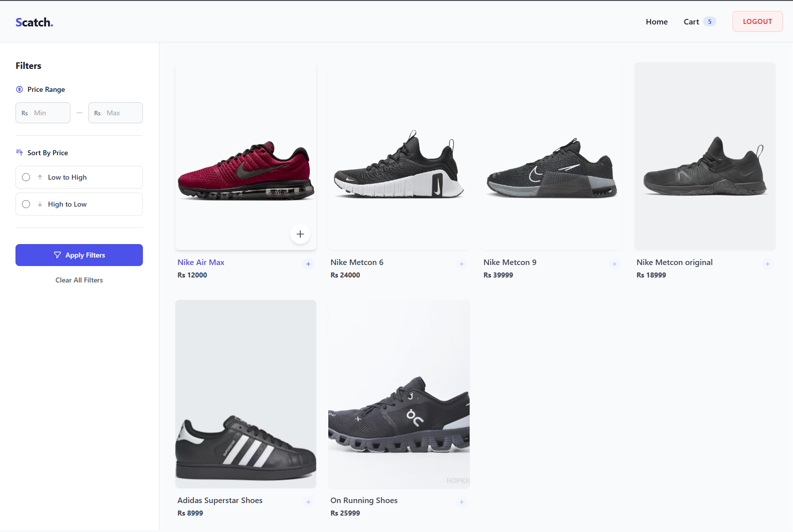
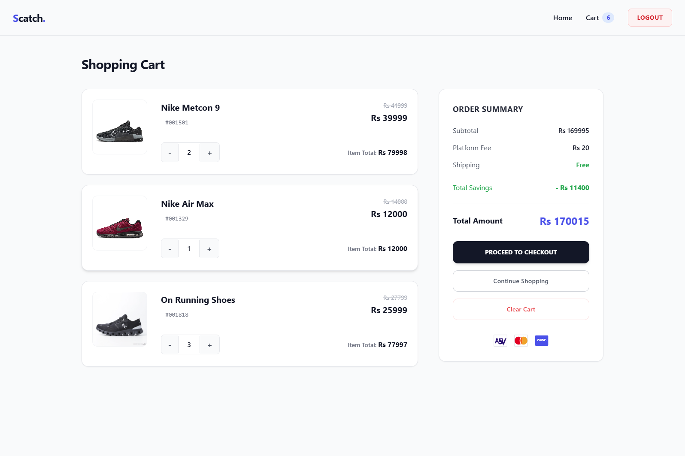
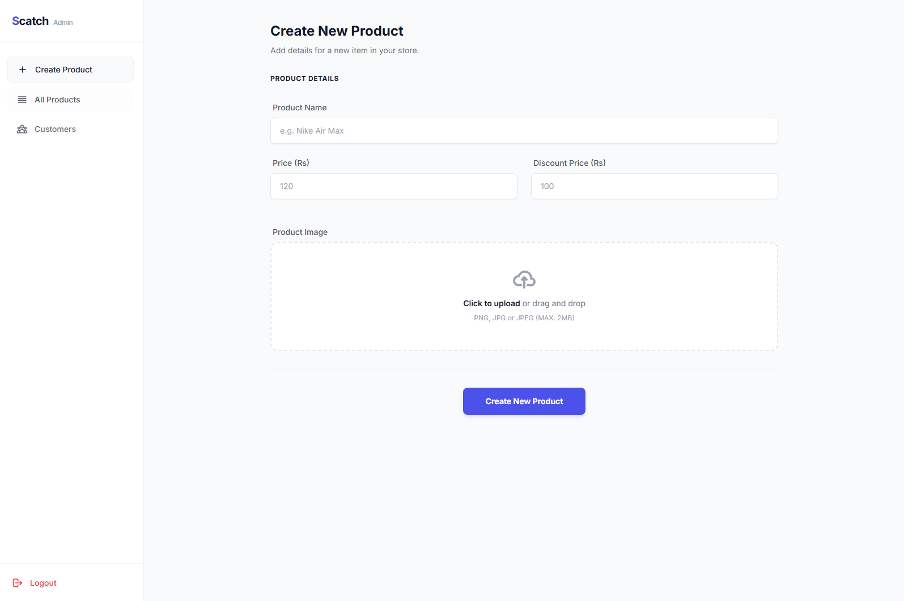

# 🛍️ SCATCH - Modern E-Commerce Platform


A full-stack e-commerce web application built with **Node.js**, **Express**, **MongoDB**, and **EJS** templating. Features a modern UI with Tailwind CSS, secure authentication, smart cart management, and a powerful admin panel.

---

## 📋 Table of Contents

- [Features](#-features)
- [Tech Stack](#-tech-stack)
- [Architecture](#-architecture)
- [Getting Started](#-getting-started)
- [Project Structure](#-project-structure)
- [Database Schema](#-database-schema)
- [Key Features Explained](#-key-features-explained)
- [API Routes](#-api-routes)
- [Screenshots](#-screenshots)
- [Environment Variables](#-environment-variables)
- [Contributing](#-contributing)
- [License](#-license)

---

## ✨ Features

### 🛒 Customer Features
- **User Authentication**: Secure registration and login with JWT & bcrypt password hashing
- **Smart Shopping Cart**:
  - Automatic quantity increment for existing products
  - Real-time cart updates with add/remove/clear functionality
  - Dynamic price calculations (subtotal, platform fees, total)
- **Advanced Product Filtering**:
  - Price range filter (min/max)
  - Sort by price (low-to-high, high-to-low)
  - Filter state persistence across page reloads
- **Responsive Design**: Beautiful UI built with Tailwind CSS
- **Flash Notifications**: Auto-dismissing success/error messages

### 🔧 Admin Features
- **Secure Admin Panel**: Protected admin routes with authentication
- **Product Management**:
  - Create products with custom styling (background color, panel color, text color)
  - Upload product images (stored as binary in MongoDB)
  - View all products in table format
  - Delete products
- **User Management**: View and manage registered users
- **Image Handling**: Multer-based image uploads with Base64 rendering

---

## 🛠️ Tech Stack

| Category | Technology |
|----------|-----------|
| **Runtime** | Node.js |
| **Framework** | Express.js |
| **Database** | MongoDB with Mongoose ODM |
| **Templating** | EJS (Embedded JavaScript) |
| **Styling** | Tailwind CSS (CDN) + Inter Font |
| **Authentication** | JWT (HTTP-only cookies) + Bcrypt |
| **File Upload** | Multer (memory storage) |
| **Middleware** | cookie-parser, express-session, connect-flash |

---

## 🏗️ Architecture

**Pattern**: MVC (Model-View-Controller)  
**Rendering**: Server-Side Rendering (SSR) with EJS templates

```
┌─────────────┐
│   Client    │
│  (Browser)  │
└──────┬──────┘
       │
       ▼
┌─────────────┐
│   Routes    │ ──────► Middleware (Auth, Flash)
└──────┬──────┘
       │
       ▼
┌─────────────┐
│ Controllers │ ──────► Business Logic
└──────┬──────┘
       │
       ▼
┌─────────────┐
│   Models    │ ──────► MongoDB (Mongoose)
└──────┬──────┘
       │
       ▼
┌─────────────┐
│    Views    │ ──────► EJS Templates
└─────────────┘
```

---

## 🚀 Getting Started

### Prerequisites
- Node.js (v14+)
- MongoDB (local or Atlas)
- npm or yarn

### Installation

1. **Clone the repository**
```bash
git clone https://github.com/yourusername/scatch.git
cd scatch
```

2. **Install dependencies**
```bash
npm install
```

3. **Set up environment variables**

Create a `.env` file in the root directory:
```env
MONGO_URI=mongodb://localhost:27017/scatch
JWT_SECRET=your_super_secret_jwt_key
SESSION_SECRET=your_session_secret
PORT=3000
NODE_ENV=development
```

4. **Start MongoDB**
```bash
# If using local MongoDB
mongod
```

5. **Run the application**
```bash
# Development mode with nodemon
npm run dev

# Production mode
npm start
```

6. **Access the application**
- Customer Shop: `http://localhost:3000/shop`
- Admin Panel: `http://localhost:3000/admin`

---

## 📁 Project Structure

```
scatch/
│
├── config/
│   ├── mongoose-connection.js    # MongoDB connection setup
│   └── multer-config.js          # Multer image upload config
│
├── controllers/
│   ├── authController.js         # Login/Register logic
│   └── productController.js      # Product CRUD operations
│
├── middlewares/
│   ├── isLoggedIn.js             # JWT verification middleware
│   └── isOwner.js                # Admin authentication check
│
├── models/
│   ├── user-model.js             # User schema (with cart)
│   ├── product-model.js          # Product schema (with images)
│   └── owner-model.js            # Admin schema
│
├── routes/
│   ├── index.js                  # Shop & Cart routes
│   ├── usersRouter.js            # User auth routes
│   └── ownersRouter.js           # Admin panel routes
│
├── views/
│   ├── shop.ejs                  # Main shopping page
│   ├── cart.ejs                  # Shopping cart page
│   ├── admin-dashboard.ejs       # Admin overview
│   └── admin-products.ejs        # Product management
│
├── public/                       # Static assets (CSS, JS, images)
│
├── app.js                        # Express app entry point
├── package.json
└── README.md
```

---

## 🗄️ Database Schema

### User Model
```javascript
{
  fullname: String,
  email: String (unique),
  password: String (hashed),
  cart: [
    {
      product: ObjectId (ref: 'product'),
      quantity: Number
    }
  ]
}
```

### Product Model
```javascript
{
  name: String,
  price: Number,
  discount: Number,
  image: Buffer (Binary),
  bgcolor: String (Hex color),
  panelcolor: String (Hex color),
  textcolor: String (Hex color)
}
```

### Owner/Admin Model
```javascript
{
  fullname: String,
  email: String (unique),
  password: String (hashed)
}
```

---

## 🎯 Key Features Explained

### Smart Cart System
The cart uses intelligent logic to manage items:
- **Add to Cart**: If product exists → increment quantity, else → add new item
- **Update Quantity**: Real-time +/- controls with instant recalculation
- **Remove Item**: Delete specific products from cart
- **Clear Cart**: One-click cart reset

### Dynamic Product Styling
Products support custom colors stored in the database:
- `bgcolor`: Card background color
- `panelcolor`: Panel/section color
- `textcolor`: Text color for contrast

### Image Handling
- **Upload**: Multer stores images in memory as Buffers
- **Storage**: Images saved as Binary data in MongoDB
- **Display**: Rendered as Base64 strings in EJS templates
```ejs
">
```

### Authentication Flow
1. User registers → Password hashed with bcrypt
2. User logs in → JWT created and stored in HTTP-only cookie
3. Protected routes → `isLoggedIn` middleware verifies JWT
4. Token decoded → User data attached to `req.user`

---

## 🛣️ API Routes

### Public Routes
| Method | Route | Description |
|--------|-------|-------------|
| GET | `/` | Landing page |
| GET | `/shop` | Browse products |
| GET | `/shop/filter` | Filter & sort products |
| POST | `/users/register` | User registration |
| POST | `/users/login` | User login |

### Protected Routes (Customer)
| Method | Route | Description |
|--------|-------|-------------|
| GET | `/cart` | View shopping cart |
| GET | `/addtocart/:id` | Add product to cart |
| GET | `/cart/remove/:id` | Remove from cart |
| GET | `/cart/clear` | Clear entire cart |
| GET | `/users/logout` | User logout |

### Admin Routes
| Method | Route | Description |
|--------|-------|-------------|
| GET | `/owner/admin/dashboard` | Admin dashboard |
| GET | `/owner/admin/inventory` | View all products |
| POST | `/owner/admin/products/create` | Create new product |
| GET | `/owner/admin/products/delete/:id` | Delete product |
| GET | `/owner/admin/costumers` | View all users |

---

## 📸 Screenshots

### Customer Shop Page


### Shopping Cart


### Admin Dashboard


---

## 🔐 Environment Variables

Create a `.env` file with the following variables:

```env
# Database
MONGO_URI=mongodb://localhost:27017/scatch

# Authentication
JWT_SECRET=your_secret_jwt_key_here
SESSION_SECRET=your_session_secret_here

# Server
PORT=3000
NODE_ENV=development

# Optional: Admin Credentials (for seeding)
ADMIN_EMAIL=admin@scatch.com
ADMIN_PASSWORD=admin123
```

---

## 🤝 Contributing

Contributions are welcome! Please follow these steps:

1. **Fork the repository**
2. **Create a feature branch**
   ```bash
   git checkout -b feature/amazing-feature
   ```
3. **Commit your changes**
   ```bash
   git commit -m 'Add some amazing feature'
   ```
4. **Push to the branch**
   ```bash
   git push origin feature/amazing-feature
   ```
5. **Open a Pull Request**

### Contribution Guidelines
- Follow the existing code style
- Write clear commit messages
- Add comments for complex logic
- Test your changes thoroughly
- Update documentation as needed

---


## 👨‍💻 Author

**Your Name**
- GitHub: [@husnainali588](https://github.com/husnainali588)
- LinkedIn: [husnainali588](www.linkedin.com/in/husnain-ali-25a437302)
- Email: husnainalimughal588@gmail.com

---

## 🙏 Acknowledgments

- [Express.js Documentation](https://expressjs.com/)
- [MongoDB Documentation](https://docs.mongodb.com/)
- [Tailwind CSS](https://tailwindcss.com/)
- [EJS Templating](https://ejs.co/)

---

## 📈 Future Enhancements

- [ ] Payment gateway integration (Stripe/PayPal)
- [ ] Order management system
- [ ] Product reviews and ratings
- [ ] Wishlist functionality
- [ ] Email notifications
- [ ] Product search with autocomplete
- [ ] Multi-language support
- [ ] Dark mode toggle
- [ ] Analytics dashboard for admin
- [ ] Inventory management

---

<div align="center">

### ⭐ If you find this project useful, please consider giving it a star!

**Made with ❤️ using Node.js and Express**

</div>